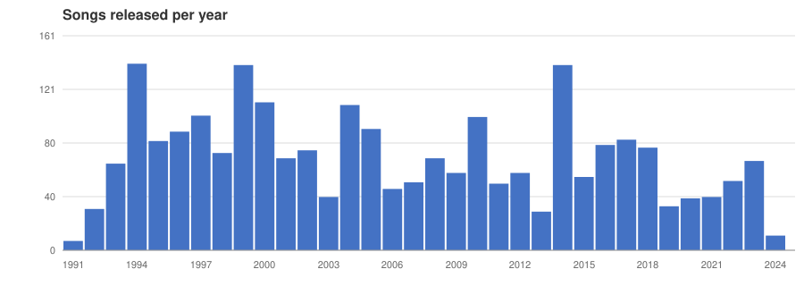
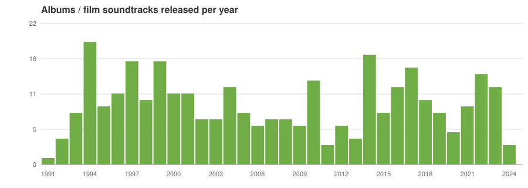
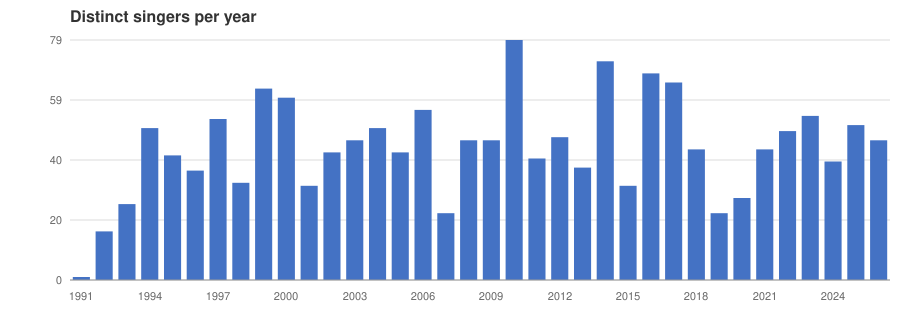

# What 35 years of A. R. Rahman looks like in data

*A blog post about building a dataset of A. R. Rahman's songs and singer collaborators from MusicBrainz — and what it took to clean it up.*

## The Mozart of Madras

If you have watched an Indian film in the last three decades, you have almost certainly heard a song by **A. R. Rahman** (Allah Rakha Rahman, born 1967 in Chennai). He broke out with Mani Ratnam's Tamil film *Roja* (1992) — a soundtrack so influential that *Time* later listed it among the ten best movie soundtracks of all time — and has been one of the most prolific and widely-heard composers in the world ever since.

Some numbers on his reach:

- **175+ films scored**, across Tamil, Hindi, Telugu, Malayalam, Kannada, English — and even Mandarin (*Warriors of Heaven and Earth*, 2003) and Persian.
- Estimated **200 million records sold**, making him one of the best-selling recording artists ever; his music may have been heard by more people than that of any other composer in history.
- **Two Academy Awards** (Best Original Score and Best Original Song for *Slumdog Millionaire*, 2009), **two Grammy Awards**, a **BAFTA**, a **Golden Globe**, **six National Film Awards** (India), **fifteen Filmfare Awards** plus ~18 Filmfare Awards South.
- Honoured with the **Padma Shri** (2000) and **Padma Bhushan** (2010), India's third-highest civilian award.
- He composed a Punjabi song for the **London 2012 Olympics opening ceremony**, scored Hollywood films (*127 Hours*, *Million Dollar Arm*, *The Hundred-Foot Journey*), and founded the KM Conservatory music school in Chennai.

One of the striking things about Rahman is the sheer variety of voices on his albums — from S. P. Balasubrahmanyam and K. S. Chithra in the 90s to Shashaa Tirupati and Sid Sriram in the 2010s. I was curious what that would look like if you took an analytical look at his whole body of work: *who actually sings for Rahman, and how does the pool of collaborators evolve year by year?*

So I built a dataset. This post is about how it was made, what "a song" means when you count it, and some of the questions you can ask of the result.

## Building the dataset from MusicBrainz

The whole pipeline lives in `src/arr_song_dataset/core.clj` (Clojure). The source of truth is [MusicBrainz](https://musicbrainz.org) — an open, community-maintained music encyclopedia — which is why the dataset is licensed under the same terms as MusicBrainz data.

The steps, tracked in the git history:

1. **Download every release** credited to Rahman's MusicBrainz artist ID. That's a paged walk over ~5,471 releases, using the MusicBrainz web service with `inc=recordings+release-groups+artist-rels+recording-rels`. MusicBrainz rate-limits aggressively, so every call goes through a `wait-till` helper that sleeps a random 0–5 seconds and retries with growing backoff (`core.clj:9`). The raw dump is kept as `arr-releases-5471.json`.

2. **Explode releases into recordings.** Each release has media/tracks, each track points at a recording. Walking 547 album releases yields **4,696 track rows** — but the same recording appears in many releases (local vs worldwide editions of the same soundtrack, re-issues...).

3. **De-duplicate recordings** (`save-recordings-table`, `core.clj:141`). This is the fiddly part. When the same recording appears under two different release IDs, the code applies a preference order, taken straight from the MusicBrainz data quirks documented in the code comments:
   - prefer a release whose secondary types include **Soundtrack** over one marked **Compilation**;
   - otherwise prefer the release event located in **India** (e.g. *Thiruda Thiruda*'s Indian pressing over the worldwide one);
   - otherwise prefer the shorter/more canonical title (a release titled *Sapnay* over *Sapnay (Original Motion Picture Soundtrack)*).
   That collapses 4,696 track rows into **3,335 unique recordings**.

4. **Filter out non-original releases.** Release groups whose secondary types are `Compilation`, `Remix` or `Live` are dropped (`remove-compilations`, `core.clj:63`) — this is what removes "Best of 90's"-style collections and tribute albums from the count.

5. **Attach singers.** For each recording, fetch its artist credits (another rate-limited walk, saved to `arr-track-details.json`) and build a `recordings × singers` join table (`data/singers.csv`). Recordings with identical titles *and* identical singer sets are merged (`remove-songs-with-identical-singers`, `core.clj:243`).

6. **Normalise dates.** The release date is taken in order: `yyyy-MM-dd` release-event date → `yyyy` release-event date → recording `first-release-date` → release-group `first-release-date` (commit `7a91528`). Every row ends up with a usable `yyyy-mm-dd` date; titles are lower-cased for matching.

7. **Load into SQLite** (`arr.db` — two tables, `songs` and `singers`), which makes it trivially queryable.

**Keeping it fresh.** The original step 1 re-walked all ~5,471 releases from scratch. That has since been replaced by an incremental update: `get-releases-for-years` (`core.clj`) queries the MusicBrainz *search* endpoint with `arid:<artist> AND date:[<y1>-01-01 TO <y2>-12-31]`, re-fetches only the newly-found releases with the full `inc=` payload, merges them into `arr-releases-5471.json`, and fetches singer credits just for the new recordings. `update-for-years` wraps that plus the derived-table rebuild — a year-range refresh costs tens of rate-limited calls instead of thousands.

**Data refresh: October 2026.** The dataset was regenerated on **2026-10-07** with the incremental update pulling releases dated 2024–2026 straight from MusicBrainz (589 releases / 3,545 recordings in the raw pipeline outputs). A same-song duplicate (*Jinguchaa*, single vs album release) was caught and removed by hand. The final dataset: **2,547 recordings** across **338 albums/film soundtracks**, sung by **658 distinct singers**, spanning releases dated **1991 to 2026** (latest: *2026-09-14*).

## What counts as "a song"?

This is the subtle question, and it shapes every number above. The unit here is a **MusicBrainz recording** — one specific captured performance of one composition. That choice has two consequences:

- **One tune, many songs.** A Rahman composition is routinely recorded in several languages: *Roja* exists as "Roja Jaaneman" (Hindi) and "Kadhal Rojave" (Tamil); films are re-scored or dubbed for Telugu and Malayalam markets. Each language version is a separate recording with (usually) different singers — so it is counted as a different song. That's intentional: the singers differ, which is exactly what this analysis cares about.

- **One song, many releases.** A recording from a film soundtrack also shows up on "Best of"-style compilations, greatest-hits albums and re-issues. Those are *not* extra songs: compilation/live/remix releases are filtered out at step 4, and duplicate release appearances of the same recording are collapsed at step 3. So the album *collection* a song appears in doesn't inflate the song count — the song is counted once, at its earliest/original release.

## What the data looks like

Two tables:

```
songs(song_id, title, date, movie_name, release_id)
singers(song_id, name)
```

### Songs per year



1994 stands out — Rahman's early-90s Tamil run (*Gentleman*, *Thiruda Thiruda*, *Duet*, *Kadhalan*...) produced 140 recordings in one year, the peak of his career by this measure. 1999 (139) and 2014 (139) are the other spikes — 2014 was famously one of his busiest years, with ~12 films in various languages. The refresh adds 2025 (67 songs, 10 soundtracks — *Kadhalikka Neramillai*, *Thug Life*, *Chhaava*, *Tere Ishk Mein*...) and 2026 so far (40 songs, 12 soundtracks).

### Albums / film soundtracks per year



1994 again tops the chart with 19 distinct soundtracks in a single year.

### Singer collaborators per year



The collaborator pool keeps widening: from 16 singers in 1992 to 60–80 distinct singers a year through the 2010s. Rahman's practice of introducing fresh voices (the "new voice on every Rahman album" effect) shows up clearly here — 2010 alone had **79 distinct singers**, versus 22 in 2007.

The top collaborators across the whole dataset: A. R. Rahman himself (1,033 recordings), S. P. Balasubrahmanyam (148), K. S. Chithra (113), Sujatha (81), Hariharan (81), Srinivas (64), Swarnalatha (63), Mano (63), Shreya Ghoshal (61), Karthik (56).

## Asking questions of the data

The dataset is small enough that plain SQL answers most questions. To explore how far you can get from natural language to SQL, `experiments/gliner-decide/` contains a QA benchmark: 31 hand-written questions (`gold.jsonl`), each with a "SQL skeleton" spec (select columns, filter, aggregation, join, order...) and reference SQL (`ref_results.json`). These feed a fine-tuning experiment with GLiNER2.5-Decide that maps a question to a SQL skeleton — see `experiments/gliner-decide/REPORT.md` for that story.

A few of the gold questions, with their reference answers:

| Question | Reference answer |
|---|---|
| How many movies has Rahman released? | **338** |
| How many singers has Rahman collaborated with? | **658** |
| When was Rahman's first album released? | **1991-01-01** |
| What was the name of Rahman's first album? | **Set Me Free** |
| Which year did Rahman compose the most movies? | **1994** |
| Who are Rahman's top 5 collaborators? | A. R. Rahman, Hariharan, K. S. Chithra, S. P. Balasubrahmanyam, Sujatha |

(Fun one: "What was the name of Rahman's first album?" → *Set Me Free* — released in 1991 under the band name "Majestic", a year before *Roja* made him a film composer.)

Each gold entry pairs the question with a structured skeleton — e.g. "Which singers sang for Rahman in the year 2016" becomes `{select_cols: [singer], filter_col: year, filter_op: year_eq, join: [songs_singers], ...}` → `SELECT DISTINCT s2.name FROM songs s1 JOIN singers s2 ON s1.song_id=s2.song_id WHERE s1.date LIKE '2016%'`.

## Reproducing

- The pipeline: open `core.clj` in a REPL and evaluate (functions are annotated with the call order at the bottom of the file). To refresh the data for recent years without a full re-crawl: `(update-for-years arr-artist-id 2025 2026 "./arr-releases-5471.json" "./arr-track-details.json")` then `(regenerate ...)`.
- The ready-made data: `data/recordings.csv` (2,547 rows) + `data/singers.csv` (4,410 rows), or load `arr.db` (rebuild it from the CSVs before use — the committed copy predates the refresh). The year charts in `doc/charts/` regenerate with `make_charts.py`.
- The QA experiment: `experiments/gliner-decide/`.

## License

The dataset is licenced under the same license as MusicBrainz data.

Copyright © 2024 FIXME

This program and the accompanying materials are made available under the
terms of the Eclipse Public License 2.0 which is available at
http://www.eclipse.org/legal/epl-2.0.

This Source Code may also be made available under the following Secondary
Licenses when the conditions for such availability set forth in the Eclipse
Public License, v. 2.0 are satisfied: GNU General Public License as published by
the Free Software Foundation, either version 2 of the License, or (at your
option) any later version, with the GNU Classpath Exception which is available
at https://www.gnu.org/software/classpath/license.html.