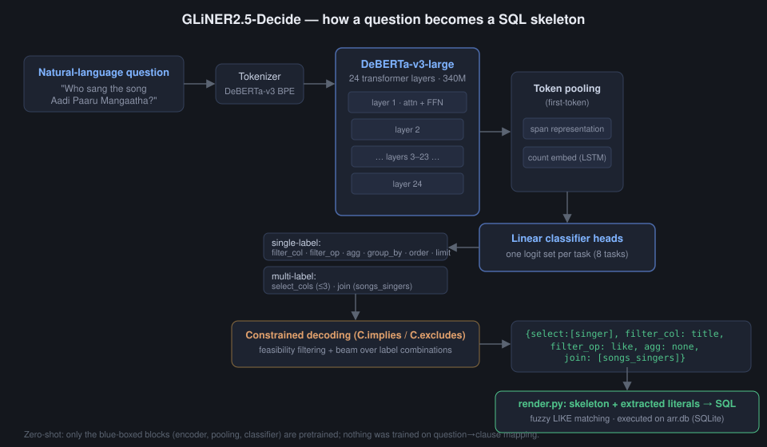
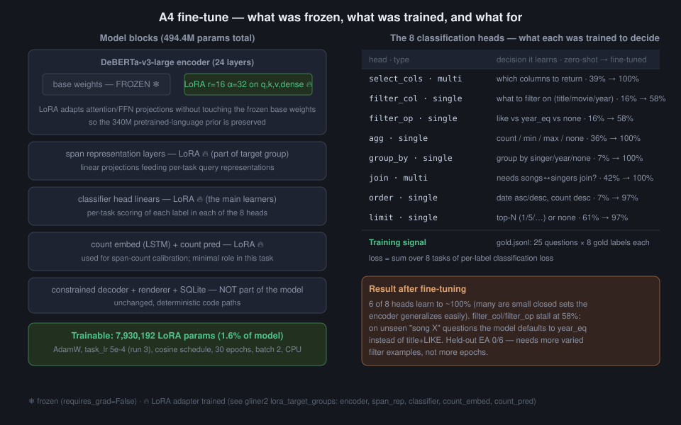
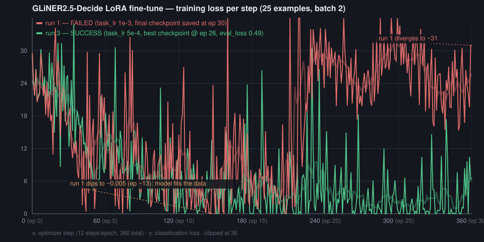

# Teaching a "Decision" Model to Write SQL: Fine-Tuning GLiNER2.5-Decide on 25 Questions

*2026-10-05 · part 2 of the ARR-QA text-to-SQL experiment series · part 1: [REPORT.md](REPORT.md)*

In the [previous experiment](REPORT.md) we asked whether **GLiNER2.5-Decide** — a 340M DeBERTa-v3-large
"decision" model from the GLiNER2 family — could turn natural-language questions about A. R. Rahman's
discography into SQL *skeletons* by pure classification. Instead of generating SQL token by token, the
model picks clause values from fixed menus: 8 classification heads (`select_cols`, `filter_col`,
`filter_op`, `agg`, `group_by`, `join`, `order`, `limit`), and a deterministic renderer turns the picks
into SQLite.

Zero-shot, it failed: 0/31 exact skeletons, 0% execution accuracy. This post is about the next step —
**LoRA fine-tuning on just 25 labeled questions** — what it taught us about the model's internals,
about a scorer bug that had corrupted our first results, and about what a 25-example fine-tune can and
cannot do.

---

## 1. The pipeline, end to end

First, the full path a question travels. The classifier never sees SQL — it sees the question and
8 menus of choices, and a constrained decoder + renderer do the rest.



The interesting design point: the *only* learned component is the encoder + per-task linear heads.
Everything after the logits is deterministic code. That makes failures easy to localize — which is
exactly what happened (twice).

## 2. What fine-tuning actually touched

Fine-tuning used the `gliner2` trainer with LoRA: the 340M encoder base stays frozen, and small
low-rank adapters are injected into the projection layers. Only **1.6% of the model (7.93M params)**
was trained, on 25 questions × 8 gold labels each.



Note the asymmetry in the results table inside that diagram: after training, 6 of the 8 heads sit at
~100%. The two that lag — `filter_col` / `filter_op` (58%) — are precisely the ones that require
*reading the question* (is "Aadi Paaru Mangaatha" a song title or a year?) rather than pattern-matching
a query shape.

## 3. The training curves: a failure, then a fix

The first run failed in a way that's worth showing honestly. With `task_lr=1e-3`, the loss **fell to
~0.005 around epoch 13** — the model had completely fit the 25 training examples — and then
**diverged** back to ~30 and never recovered. We initially read the end-state model (0% head accuracy
even on its own training data) as "can't fit tiny data." Wrong: it had fit, and then the learning rate
blew it up. This is not overtraining (training loss itself exploded); it's plain LR-too-high
instability.



The fix was mechanical: 5× lower learning rate, per-epoch evaluation, and `save_best` on eval loss so
the good checkpoint survives even if late training degrades. Run 3 converged cleanly (best eval loss
0.49 at epoch 26) and the difference is enormous:

| Metric (all 31 queries) | zero-shot | fine-tuned (run 1, diverged) | fine-tuned (run 3, best ckpt) |
|---|---|---|---|
| Exact skeleton accuracy | 0% | 0% | **54.8%** |
| Execution accuracy | 0% | 0% | **41.9%** |
| select_cols / agg / group_by / join | ≤ 42% | ≤ 100% | **100%** |
| filter_col / filter_op | 16.1% | 48.4% | **58.1%** |

From *never producing a single correct SQL* to 13/31 correct answers, using 25 examples and 80 CPU
minutes.

## 4. The bug we found on the way

While validating the fine-tuned model we noticed the scorer reported 0% on heads where manual
inspection showed obvious matches. The cause: `score.py` compared predictions (lists) against gold
labels (bare strings) with `sorted()` — and `sorted('none')` is `['e','n','n','o']`, which can never
equal `['none']`. Every single-label head had been silently unscorable in the zero-shot phase. After
the fix, the zero-shot numbers changed materially — and one conclusion **reversed**: the constraint
set is not neutral, it is *net-negative* (constrained agg 35.5% vs unconstrained 74.2%). The
implications we encoded prune correct assignments. Full correction in [REPORT.md](REPORT.md).

## 5. The honest bottom line

- **Fine-tuning vindicates the head decomposition.** 6 of 8 clause decisions are learnable to
  near-perfection from 25 examples. A "decision model" *can* do text→SQL this way.
- **It does not yet generalize on the hard head.** On the 6 held-out questions, EA is 0/6: unseen
  "song X" questions get `year_eq` instead of `title`+`LIKE`. The model needs more *varied* filter
  examples — more titles, more phrasings — not more epochs, and probably not more capacity.
- **Checkpoints matter at this scale.** The best and final checkpoints of the *same run* differ by 42
  points of EA. At 25 examples, training dynamics are violent; always save-best.

Everything is reproducible from the repo:

```bash
cd experiments/gliner-decide
.venv/bin/python finetune.py --epochs 30 --batch-size 2 --task-lr 5e-4 --seed 42
.venv/bin/python predict.py --run finetuned-lora-best --adapter results/lora3/best
.venv/bin/python score.py --pred results/pred_finetuned-lora-best.json
```

*Diagrams: [architecture.svg](diagrams/architecture.svg),
[lora-targets.svg](diagrams/lora-targets.svg),
[training-curves.svg](diagrams/training-curves.svg) (regenerate with
`make_curves_svg.py`). Adapter checkpoints (~30 MB each) are not committed.*
